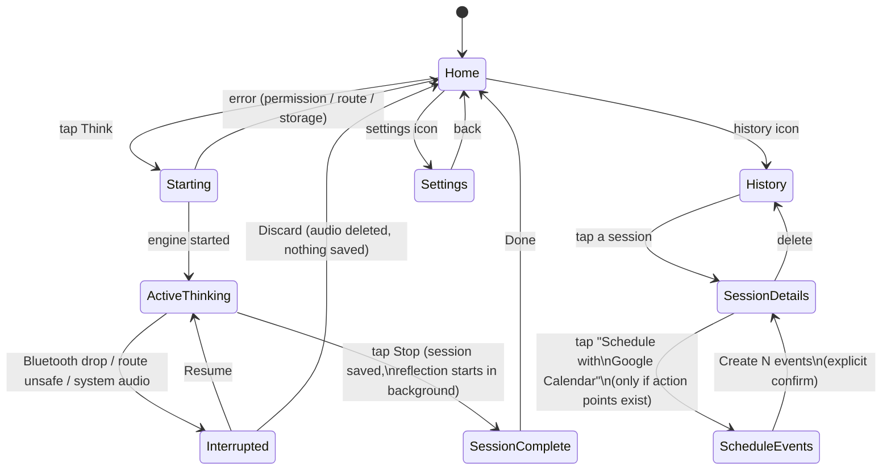

# Design System

## Status: resolved (v2)

No design system named "DesignMD" was ever found in this repo, any linked
Figma, or any provided asset (checked at project start — see git history).
What follows is the fallback direction from Phase 1, now deliberately
refined and formalized rather than left as a stand-in. It is implemented
in `lib/core/theme/` — this document explains the *why*; the code is the
source of truth for exact values.

## Philosophy

**Quiet confidence, not an AI dashboard.** This is a personal thinking
tool, closer in spirit to a paper journal or an e-reader than a
productivity dashboard — calm, low-stimulus, unhurried. Cross-checked
against real design-pattern data (ui-ux-pro-max skill): this app's
existing palette and layout already scored as a strong match for the
"E-Ink / Paper" style (reading apps, minimal journals, distraction-free
writing) and "Flat Design Mobile" interaction patterns (zero elevation,
color/border for hierarchy instead of shadow) — so v2 keeps every
already-shipped, on-device-tested value and fills the gaps those checks
surfaced, rather than re-skinning the app.

## Tokens (`lib/core/theme/`)

### Color (`app_colors.dart`)

Warm off-white / near-black in light mode, calm dark mode, one accent
used sparingly — the Think button and active states, never for
decoration. Unchanged from Phase 1 (already close to the "E-Ink/Paper"
reference values independently) — reformalized as explicit semantic
roles via `ColorScheme` in `app_theme.dart` (`primary`, `onPrimary`,
`surface`, `onSurface`, `error`) rather than raw hex scattered through
widgets.

### Typography (`app_typography.dart`) — v2

**Lora** (display/title) + **Raleway** (body) — a serif/humanist-sans
pairing matched to "calm, reading-focused, unhurried" (ui-ux-pro-max's
"Wellness Calm" pairing). Bundled as local font assets
(`assets/fonts/`, wired in `pubspec.yaml`) rather than a
runtime-fetching package (`google_fonts`) — consistent with this app's
local-first principle; nothing is downloaded at runtime.

This closes the one gap Phase 1 explicitly flagged and left open
(`app_typography.dart`'s old comment: "no font assets were available to
embed in this environment").

### Spacing (`app_spacing.dart`)

4/8/16/24/40/64 — unchanged; already close to the reference 4pt scale
recommendation (4/8/16/24/32/48). Not worth perturbing a scale already
used consistently across every screen.

### Motion (`app_motion.dart`) — v2, new

Previously: durations hardcoded ad-hoc per widget (150ms here, 200ms
there). Now centralized:

- `fast` (150ms) — micro-interactions (waveform level changes, press
  feedback)
- `medium` (220ms) — container/state transitions (Think button idle ↔
  loading)
- `slow` (320ms) — reserved for larger transitions, not yet used
- `enter` = `easeOut`, `exit` = `easeIn` — standard asymmetric easing
- `pressedScale` (0.96) — subtle scale-down on press, used on the Think
  button (previously had **no** press feedback at all — a real gap on
  the single most important interactive element in the app)

All motion stays subtle-only per the original direction — nothing here
introduces attention-seeking animation, just consistency and one
missing interaction cue.

### Elevation

Zero everywhere — cards, app bars, buttons. Separation comes from
color/border, not shadow (`dividerTheme`, `CardTheme`'s `BorderSide`).
Matches "Flat Design Mobile" reference guidance already independently
in place.

## Flow / information architecture

Background, not a navigable state: after Stop, `AiProcessingStatus`
moves `notProcessed → pending → complete|failed` while the user may
already be anywhere else in the app. Session Details polls lightly
while pending (no push channel to a screen that might not be mounted)
and shows a distinct state for each: pending (spinner), complete
(summary/ideas/actions/questions, only sections that have content),
failed (retry button).

## Components

- **Think button**: unmistakable, calm, single largest tap target on
  its screen. v2 adds press-down scale feedback (was previously static
  — the button had zero tactile response to a tap, a real interaction
  gap on the app's most important control).
- **Cards**: rare, not the default container (per original direction) —
  used only in Session Details' bullet sections and the Calendar
  scheduling review list, where grouping genuinely helps.
- **Error states**: four distinct, explicit states (permission denied,
  no safe route, storage failure, engine failure) — never a generic
  spinner-then-nothing. See `home_screen.dart`'s `_ErrorContent`.
- **Empty states**: History and Session Details both have considered
  empty/not-found states, not a blank screen.

## Accessibility commitments

- Text contrast: light-mode body text (`#1C1A17` on `#FAF7F2`) and
  dark-mode (`#F3EFE7` on `#15130F`) both exceed 4.5:1.
- Touch targets: Think button (176×176) and Stop button (full-width,
  56pt height) far exceed the 44×44pt minimum; icon buttons use
  Flutter's default 48dp minimum.
- Screen reader labels: Think/Stop/play-pause all have explicit
  `Semantics`/tooltip labels (audited in Phase 8 polish).
- Reduced motion: all animations here are already short (≤320ms) and
  non-essential to comprehension — nothing relies on motion to convey
  information that isn't also shown statically.

## Known gaps / not done in this pass

- No named-route navigation (`Navigator.push(MaterialPageRoute(...))`
  throughout) — flagged by `ui-ux-pro-max`'s Flutter guidelines as a
  "use named routes / go_router" pattern for larger apps. Not adopted
  here: the app has ~8 screens with simple push/pop flows, and
  rewriting navigation is a real behavioral-risk refactor for a
  cosmetic-tier gain. Worth revisiting if the screen count grows
  significantly.
- ~~Font rendering not yet re-verified~~ — verified via on-device
  screenshots (Android emulator, light + dark mode): Lora and Raleway
  both render correctly, not falling back to system font.
